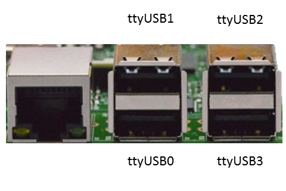

# Humidity Control Server for RPi 3B+

RaspberryPi 3B+ Pinout

  
 

It is used and DHT22 sensor for humidity and temperature measure. VCC+ goes on pin 1, GND on pin 6 and Signal on pin 3.

To control the On/Off of the humidifier, we are using the library [uhubctl](https://github.com/mvp/uhubctl). By default, the program is controlling the **ttyUSB2** to connect it, so, connect the humidier there.

 

RaspberryPi 3B+ Front View

